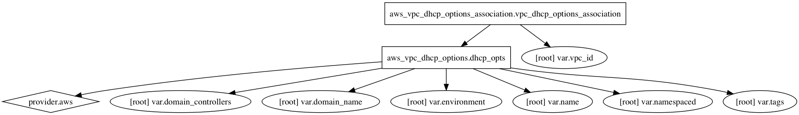

AWS DHCP Terraform Module
=====================

Usage:
------

    module "dhcp" {
      source      = "../tf_dhcp"

      add variables
    }

## Inputs

| Name | Description | Default | Required |
|------|-------------|:-----:|:-----:|
| domain_controllers | Domain name servers | `<list>` | no |
| domain_name | Domain name to be assigned by DHCP | - | yes |
| environment | Environment (ex: dev, qa, stage, prod) | - | yes |
| name | Name | - | yes |
| namespaced | Namespace all resources (prefixed with the environment)? | `true` | no |
| tags | A map of tags to add to all resources | `<map>` | no |
| vpc_id | AWS VPC ID | - | yes |

### Resource Graph

